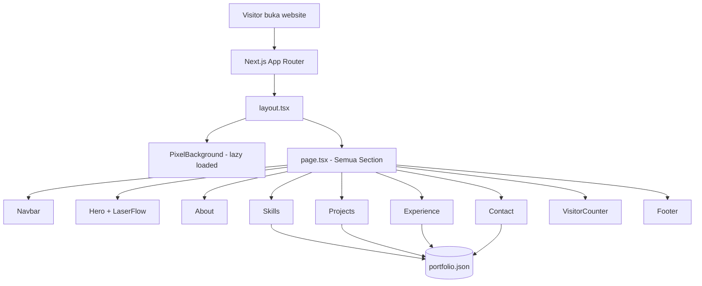

<div align="center">

# Portfolio Adinda Salsa — Data Analyst

[](https://salsa.tams.codes)
[](https://github.com/el-pablos/web-porto-salsa/actions)
[](https://nextjs.org)
[](https://typescriptlang.org)
[](https://tailwindcss.com)
[](https://github.com/el-pablos/web-porto-salsa/actions)

**Portfolio digital Adinda Salsa Aryadi Putri — Data Analyst & Researcher.**
**Full responsive, mobile-first, smooth animations.**

[Live Demo](https://salsa.tams.codes) · [Repository](https://github.com/el-pablos/web-porto-salsa)

</div>

---

## Deskripsi

Website portfolio pribadi untuk **Adinda Salsa Aryadi Putri** — mahasiswi Sosiologi FISIP UNAS yang fokus di bidang Data Analysis dan Riset Kuantitatif. Dibangun pake Next.js 14 dengan TypeScript, Tailwind CSS buat styling, dan Framer Motion buat animasi smooth.

Desain menggunakan **tema pink pastel** yang soft dan feminin dengan glass morphism effect — berdasarkan feedback langsung dari pemilik portfolio.

Live di **[salsa.tams.codes](https://salsa.tams.codes)**.

## Tech Stack

| Teknologi | Versi | Kegunaan |
|---|---|---|
| Next.js | 14 | Framework React dengan SSR dan App Router |
| TypeScript | 5.7 | Static typing buat keamanan kode |
| Tailwind CSS | 3.4 | Utility-first CSS framework |
| Framer Motion | 11 | Animasi komponen yang smooth |
| React Icons | 5 | Kumpulan icon SVG |
| Jest + RTL | 29 | Unit testing dan component testing |
| GitHub Actions | - | CI/CD automation |
| Vercel | - | Hosting dan deployment |
| Redis Cloud | - | Visitor counter backend |

## Arsitektur

```
src/
├── app/                       # Next.js App Router
│   ├── layout.tsx             # Root layout + PixelBackground (lazy loaded)
│   ├── page.tsx               # Halaman utama
│   ├── globals.css            # Global styles + glass morphism
│   ├── not-found.tsx          # Custom 404 (FuzzyText)
│   └── error.tsx              # Custom 500 (FuzzyText)
├── components/
│   ├── Navbar.tsx             # Navigasi responsive + glass effect
│   ├── Hero.tsx               # Hero + LaserFlow (lazy loaded) + ShuffleText
│   ├── About.tsx              # Tentang saya
│   ├── Skills.tsx             # Skill tags/chips (dari portfolio.json)
│   ├── Projects.tsx           # Project cards (dari portfolio.json)
│   ├── Experience.tsx         # Timeline pengalaman & pendidikan
│   ├── Contact.tsx            # Form kontak + info
│   ├── VisitorCounter.tsx     # Stats counter animasi
│   ├── Footer.tsx             # Footer
│   └── effects/               # Efek visual
│       ├── ShuffleText.tsx    # Animasi shuffle teks
│       ├── FuzzyText.tsx      # Animasi glitch teks
│       ├── CountUp.tsx        # Counter animasi
│       ├── LaserFlow.tsx      # Background laser (optimized 30fps)
│       └── PixelBackground.tsx # Global pixel background (optimized 30fps)
├── data/
│   └── portfolio.json         # Single source of truth untuk semua konten
└── __tests__/                 # 35 unit tests, 10 suites
```

## Flowchart



## Cara Development

```bash
# clone repo
git clone https://github.com/el-pablos/web-porto-salsa.git
cd web-porto-salsa

# install dependencies
npm install

# setup environment (copy dan isi credentials)
cp .env.example .env

# jalankan development server
npm run dev

# jalankan tests
npm test

# build production
npm run build
```

## Testing

- **10 test suites**, **35 tests** — semua **100% passed**
- Framework: Jest + React Testing Library
- Coverage: semua komponen utama dan efek visual

## Optimasi Performa

- Canvas animations di-throttle ke 30fps
- Visibility API pause saat tab tidak aktif
- Resize handler di-debounce
- Google Fonts via `next/font` (no render blocking)
- Dynamic import dengan `ssr: false` untuk canvas components
- Console.log dihapus otomatis di production build
- First Load JS: ~135kB

## Kontributor

<a href="https://github.com/el-pablos/web-porto-salsa/graphs/contributors">
  
</a>

---

<div align="center">

**Dibuat oleh [el-pablos](https://github.com/el-pablos)**


</div>
