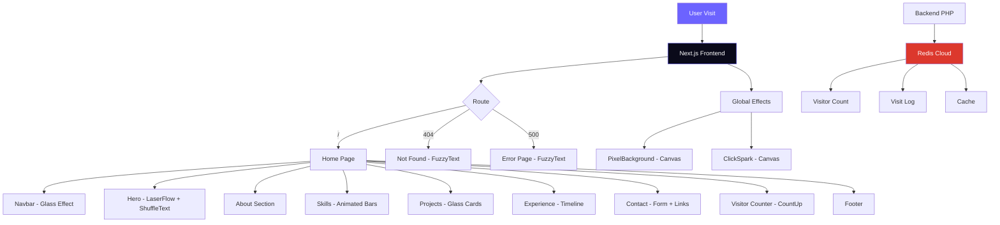
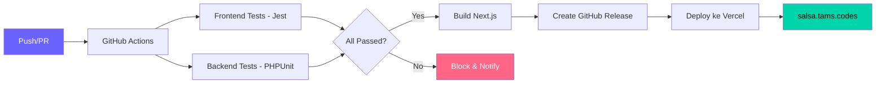

<div align="center">

# ✨ Portfolio — Adinda Salsa Aryadi Putri


**Website portofolio personal yang dibangun dengan teknologi modern.**
**Full responsive, mobile-first, smooth animations.**

[🌐 Live Demo](https://salsa.tams.codes) · [📂 Repository](https://github.com/el-pablos/web-porto-salsa)

</div>

---

## 📖 Deskripsi Projek

Website portfolio pribadi untuk **Adinda Salsa Aryadi Putri** — seorang Data Analyst & QA Enthusiast. Website ini dibangun menggunakan Next.js 14 dengan TypeScript, Tailwind CSS untuk styling, dan Framer Motion untuk animasi yang smooth di setiap sudut.

Desain dibuat dengan pendekatan **mobile-first** dan setiap elemen memiliki sudut yang smooth (border-radius), transisi yang halus, serta efek visual interaktif.

## 🏗️ Arsitektur Projek

```
web-porto-salsa/
├── src/
│   ├── app/                    # Next.js App Router
│   │   ├── layout.tsx          # Root layout + global effects
│   │   ├── page.tsx            # Halaman utama
│   │   ├── not-found.tsx       # Custom 404 page (FuzzyText)
│   │   ├── error.tsx           # Custom error page (FuzzyText)
│   │   └── globals.css         # Global styles + glass morphism
│   ├── components/
│   │   ├── Navbar.tsx          # Navigasi responsive + glass effect
│   │   ├── Hero.tsx            # Hero section + LaserFlow background
│   │   ├── About.tsx           # Tentang saya
│   │   ├── Skills.tsx          # Skill bars animated
│   │   ├── Projects.tsx        # Project cards
│   │   ├── Experience.tsx      # Timeline pengalaman & pendidikan
│   │   ├── Contact.tsx         # Form kontak + info
│   │   ├── VisitorCounter.tsx  # Statistik count-up
│   │   ├── Footer.tsx          # Footer
│   │   └── effects/            # Efek visual (ReactBits-inspired)
│   │       ├── ShuffleText.tsx # Animasi shuffle teks (welcoming)
│   │       ├── FuzzyText.tsx   # Animasi glitch teks (error pages)
│   │       ├── CountUp.tsx     # Counter animasi (visitor stats)
│   │       ├── LaserFlow.tsx   # Background laser (hero section)
│   │       ├── ClickSpark.tsx  # Spark effect di setiap klik
│   │       └── PixelBackground.tsx # Global pixel background
│   └── data/
│       └── portfolio.json      # Data konten portfolio
├── backend/
│   ├── src/RedisService.php    # Redis service (Predis) visitor log
│   ├── public/api.php          # API endpoint
│   └── composer.json           # PHP dependencies
├── __mocks__/                  # Jest mocks (framer-motion, dll)
├── .github/workflows/
│   └── main.yml                # CI/CD pipeline (test + auto release)
├── jest.config.js              # Konfigurasi Jest
├── tailwind.config.js          # Konfigurasi Tailwind
├── next.config.js              # Konfigurasi Next.js
├── vercel.json                 # Konfigurasi deployment Vercel
└── .env.example                # Template environment variables
```

## 🔄 Flowchart Arsitektur



## 🔄 CI/CD Flow



## 🎨 Fitur Visual

| Komponen | Efek | Inspirasi |
|----------|------|-----------|
| Hero Section | Laser flow background + shuffle text | ReactBits LaserFlow + Shuffle |
| Error Pages | Glitch/fuzzy text animation | ReactBits FuzzyText |
| Stats Section | Animated count up | ReactBits CountUp |
| Global | Pixel blast background | ReactBits PixelBlast |
| Global | Click spark particles | ReactBits ClickSpark |
| All Cards | Glass morphism + hover lift | Custom |

## 🧪 Testing

- **Frontend:** Jest + React Testing Library
- **10 test suites**, **34 tests** — semua **100% passed**
- **Backend:** PHPUnit (untuk Redis service)

## 🚀 Cara Menjalankan

```bash
# Clone repo
git clone https://github.com/el-pablos/web-porto-salsa.git
cd web-porto-salsa

# Install dependencies
npm install

# Setup environment (copy dan isi credentials)
cp .env.example .env

# Jalankan development server
npm run dev

# Jalankan tests
npm test

# Build production
npm run build
```

## 🛠️ Tech Stack

- **Framework:** Next.js 14 (App Router)
- **Language:** TypeScript
- **Styling:** Tailwind CSS + Custom Glass Morphism
- **Animation:** Framer Motion + Custom Canvas Effects
- **Backend:** PHP 8.3 + Predis (Redis Cloud)
- **Testing:** Jest + React Testing Library
- **CI/CD:** GitHub Actions + Auto Release
- **Hosting:** Vercel
- **DNS:** Cloudflare

## 👥 Kontributor

<table>
  <tr>
    <td align="center">
      <a href="https://github.com/adndaaryadi">
        <br>
        <b>Adinda Salsa Aryadi Putri</b>
      </a><br>
      <sub>Portfolio Owner</sub>
    </td>
    <td align="center">
      <a href="https://github.com/el-pablos">
        <br>
        <b>el-pablos</b>
      </a><br>
      <sub>Developer & Builder</sub>
    </td>
  </tr>
</table>

---

<div align="center">

**Dibuat dengan ❤️ oleh [el-pablos](https://github.com/el-pablos)**


</div>
