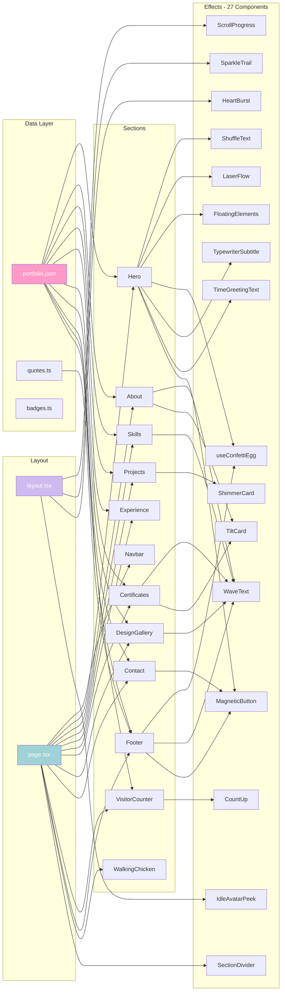
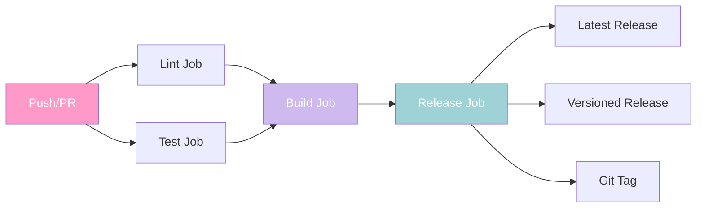

<div align="center">

# 🌸 Portfolio — Adinda Salsa Aryadi Putri

**Sociology Student | Data Analyst & Social Researcher**

*Menganalisis fenomena sosial dengan pendekatan data-driven untuk perubahan yang bermakna*

[](https://salsa.tams.codes)
[](https://nextjs.org)
[](https://typescriptlang.org)
[](https://tailwindcss.com)
[](https://jestjs.io)
[](https://github.com/el-pablos/web-porto-salsa/releases)

</div>

---

## 📋 Daftar Isi

- [Deskripsi Projek](#-deskripsi-projek)
- [Screenshot Tiap Halaman](#-screenshot-tiap-halaman)
- [Tech Stack](#-tech-stack)
- [Arsitektur Projek](#-arsitektur-projek)
- [Diagram Flowchart](#-diagram-flowchart)
- [Diagram Komponen](#-diagram-komponen)
- [Data Flow](#-data-flow)
- [Fitur Lengkap](#-fitur-lengkap)
- [Section Website](#-section-website)
- [Animasi & Efek Interaktif](#-animasi--efek-interaktif)
- [Easter Eggs](#-easter-eggs)
- [Design System](#-design-system)
- [Responsive Design](#-responsive-design)
- [Cara Jalanin Lokal](#-cara-jalanin-lokal)
- [Testing](#-testing)
- [CI/CD Pipeline](#-cicd-pipeline)
- [Deployment](#-deployment)
- [Kontributor](#-kontributor)
- [Statistik Repo](#-statistik-repo)
- [Lisensi](#-lisensi)

---

## 🎯 Deskripsi Projek

Website portfolio pribadi buat **Adinda Salsa Aryadi Putri** — mahasiswi Sosiologi FISIP Universitas Nasional (UNAS) yang punya passion di bidang Data Analysis, Social Research, dan teknologi. Website ini dibangun pake **Next.js 14** dengan **TypeScript**, **Tailwind CSS** buat styling, dan **Framer Motion** buat animasi yang smooth dan interaktif.

Desainnya pake **tema pink pastel soft** yang feminin dan elegan dengan glass morphism effect, blob morphing background, sparkle cursor trail, dan berbagai micro-interactions lucu yang bikin pengalaman browsing jadi menyenangkan. Semua konten diambil dari satu sumber data (`portfolio.json`) yang memudahkan update tanpa harus ubah kode komponen.

Website ini menampilkan **10 section utama** yang mencakup:
- **Profil & Bio** — perkenalan lengkap dengan highlight kemampuan
- **Keahlian** — 5 kategori skill (Data Analysis, Visualization, Database & Query, Tech Tools, Soft Skills)
- **9 Proyek** — gabungan proyek data analysis, creative, tech, sociopreneurship, dan research
- **5 Pengalaman** — magang di KND, organisasi UNAS FEST & YRI, pengabdian masyarakat ARKEDUNA, volunteer Generasi Bebas Plastik
- **6 Sertifikat** — dari berbagai kegiatan organisasi dan volunteer
- **8 Desain** — galeri infografis, poster, sticker, dan logo
- **Kontak** — form email, LinkedIn, GitHub, Instagram, telepon
- **Statistik** — counter animasi proyek, dataset, tools, sertifikat, tahun belajar

Semua section **full responsive** — mobile-first design yang optimal di HP, tablet, dan desktop. Plus ada **easter eggs** tersembunyi yang bikin website ini lebih fun!

Live di **[salsa.tams.codes](https://salsa.tams.codes)**.

---

## 📸 Screenshot Tiap Halaman

Berikut screenshot dari PDF portfolio asli yang jadi referensi konten website ini:

### Halaman 1 — Cover Portfolio


### Halaman 2 — Introduction & Tools


### Halaman 3 — Organisasi: UNAS FEST Tabulator


### Halaman 4 — Committee: Youth Ranger Indonesia


### Halaman 5 — Community Service: ARKEDUNA


### Halaman 6 — Volunteer: Generasi Bebas Plastik


### Halaman 7 — SILAF (Sistem Layanan Administrasi FISIP)


### Halaman 8 — Project Photostory: Nusantara


### Halaman 9 — Project Sociology Visual: Social Interaction


### Halaman 10 — Project Virtual Exhibition: Urban Life


### Halaman 11-12 — Project Sociopreneurship: EcoCraft Creation


### Halaman 13-14 — My Design (Infografis, Poster, Sticker)


### Halaman 15-16 — Certificate (6 Sertifikat)


### Halaman 17 — Contact


---

## 🛠 Tech Stack

| Teknologi | Versi | Kegunaan |
|---|---|---|
| **Next.js** | 14 | Framework React dengan SSR, App Router, dan static generation |
| **TypeScript** | 5.7 | Static typing buat keamanan dan maintainability kode |
| **Tailwind CSS** | 3.4 | Utility-first CSS framework dengan custom design tokens |
| **Framer Motion** | 11 | Library animasi dan transisi yang smooth |
| **React Icons** | 5.4 | Icon library (HeroIcons, Font Awesome) |
| **react-intersection-observer** | 9.14 | Lazy loading dan scroll-triggered animations |
| **react-type-animation** | 3.2 | Typewriter effect buat subtitle |
| **canvas-confetti** | 1.9 | Efek confetti easter egg |
| **vanilla-tilt** | 1.8 | 3D tilt effect pada cards |
| **Jest** | 29 | Unit testing framework |
| **Testing Library** | 16 | Testing utilities buat React components |
| **Playwright** | 1.58 | E2E testing framework |
| **GitHub Actions** | — | CI/CD pipeline otomatis (lint → test → build → release) |
| **Vercel** | — | Hosting dan deployment platform |

---

## 🏗 Arsitektur Projek

```
web-porto-salsa/
├── .github/
│   └── workflows/
│       └── main.yml                    # CI/CD: lint → test → build → release
├── __mocks__/
│   ├── framer-motion.js                # Mock framer-motion buat unit test
│   ├── react-intersection-observer.js  # Mock intersection observer
│   └── styleMock.js                    # Mock CSS imports
├── backend/
│   ├── public/
│   │   └── api.php                     # PHP API visitor counter (Redis)
│   └── composer.json                   # PHP dependencies
├── e2e/
│   └── verify-animations.spec.ts       # E2E test animasi (Playwright)
├── src/
│   ├── app/
│   │   ├── layout.tsx                  # Root layout + global effects (ScrollProgress, SparkleTrail, HeartBurst, IdleAvatarPeek)
│   │   ├── page.tsx                    # Halaman utama — compose 10 section + dividers
│   │   ├── globals.css                 # Global styles, animasi keyframes, custom scrollbar
│   │   ├── not-found.tsx               # Custom 404 page (FuzzyText effect)
│   │   └── error.tsx                   # Custom 500 page (FuzzyText effect)
│   ├── components/
│   │   ├── Navbar.tsx                  # Navigasi responsive + glass morphism + active section indicator
│   │   ├── Hero.tsx                    # Hero section + ShuffleText + LaserFlow + FloatingElements + Confetti
│   │   ├── About.tsx                   # Tentang saya + 4 highlight cards (TiltCard)
│   │   ├── Skills.tsx                  # 5 kategori skill dengan level dots animasi
│   │   ├── Projects.tsx                # 9 project cards + filter kategori + ShimmerCard
│   │   ├── Experience.tsx              # Timeline 5 pengalaman + 1 pendidikan (alternating, scroll-animated)
│   │   ├── Certificates.tsx            # 6 sertifikat cards dengan TiltCard effect [BARU]
│   │   ├── DesignGallery.tsx           # 8 desain gallery dengan filter kategori [BARU]
│   │   ├── Contact.tsx                 # Form kontak mailto + 5 social links + validasi real-time
│   │   ├── VisitorCounter.tsx          # 5 stats counter animasi (CountUp)
│   │   ├── Footer.tsx                  # Footer + 3 social links + random quotes + confetti easter egg
│   │   ├── WalkingChicken.tsx          # Easter egg ayam jalan-jalan + lay eggs
│   │   └── effects/                    # 27 efek visual & animasi interaktif
│   │       ├── BouncyEntrance.tsx      # Animasi entrance bouncy saat scroll
│   │       ├── BouncyIcon.tsx          # Icon dengan bounce effect
│   │       ├── ChickenEggLayer.tsx     # Chicken egg laying logic
│   │       ├── CountUp.tsx             # Animasi count up angka
│   │       ├── FloatingElements.tsx    # Elemen dekoratif melayang (✦ ◇ ○ ✿ ⬡)
│   │       ├── FuzzyText.tsx           # Animasi glitch teks (error pages)
│   │       ├── HeartBurst.tsx          # Heart particles saat klik
│   │       ├── IdleAvatarPeek.tsx      # Avatar peek saat user idle 45 detik
│   │       ├── LaserFlow.tsx           # Canvas laser beam background
│   │       ├── MagneticButton.tsx      # Button yang "tertarik" ke cursor
│   │       ├── ParallaxLayer.tsx       # Parallax scrolling layer
│   │       ├── PixelBackground.tsx     # Pixel grid background effect
│   │       ├── ProgressRing.tsx        # Ring progress animasi
│   │       ├── RandomQuoteDisplay.tsx  # Random quotes di footer (auto-rotate)
│   │       ├── RippleButton.tsx        # Ripple effect saat klik button
│   │       ├── ScrollProgress.tsx      # Progress bar gradient di atas halaman
│   │       ├── SectionDivider.tsx      # Wave/curve divider antar section
│   │       ├── ShimmerCard.tsx         # Hover shimmer/holographic effect
│   │       ├── ShuffleText.tsx         # Teks acak random lalu settle
│   │       ├── SparkleTrail.tsx        # Sparkle cursor trail (desktop only)
│   │       ├── StaggerReveal.tsx       # Stagger reveal animasi children
│   │       ├── TiltCard.tsx            # 3D tilt effect pada cards
│   │       ├── TimeGreetingText.tsx    # Greeting dinamis berdasarkan waktu
│   │       ├── TypewriterSubtitle.tsx  # Typewriter effect subtitle
│   │       ├── useConfettiEgg.ts       # Hook easter egg confetti (klik 5x)
│   │       ├── WalkingChicken.tsx      # Walking chicken SVG animasi
│   │       └── WaveText.tsx            # Wave animasi per karakter
│   ├── context/
│   │   ├── AchievementContext.tsx      # Context gamification badges
│   │   └── index.ts                    # Context exports
│   ├── data/
│   │   ├── portfolio.json              # Data konten portfolio (SINGLE SOURCE OF TRUTH)
│   │   ├── quotes.ts                   # 24 quotes (motivational, sociology, data, cute, tech-humor)
│   │   └── badges.ts                   # 12 achievement badges (gamification)
│   └── __tests__/                      # Unit tests — 79 tests, 26 suites
│       ├── components/                 # Test komponen utama (Hero, About, Skills, Projects, dll)
│       ├── effects/                    # Test efek visual (ShuffleText, TiltCard, CountUp, dll)
│       └── hooks/                      # Test custom hooks (useTimeGreeting, useIdleDetection)
├── tailwind.config.js                  # Konfigurasi tema pink pastel + custom tokens
├── jest.config.js                      # Konfigurasi Jest
├── jest.setup.ts                       # Jest setup (matchMedia mock, dll)
├── playwright.config.ts                # Konfigurasi Playwright E2E
├── next.config.js                      # Next.js config (image optimization, console removal)
├── vercel.json                         # Vercel deployment config
├── tsconfig.json                       # TypeScript config
└── package.json                        # Dependencies & scripts (v3.0.0)
```

---

## 📊 Diagram Flowchart


```mermaid
flowchart TD
    A[User Buka Website] --> B[layout.tsx]
    B --> C[Global Effects]
    C --> C1[ScrollProgress]
    C --> C2[SparkleTrail]
    C --> C3[HeartBurst]
    C --> C4[IdleAvatarPeek]

    B --> D[page.tsx]
    D --> E[Navbar]
    D --> F[Hero Section]
    F --> F1[LaserFlow Canvas]
    F --> F2[FloatingElements]
    F --> F3[ShuffleText + Confetti]
    F --> F4[TypewriterSubtitle]
    F --> F5[TimeGreetingText]

    D --> G[SectionDivider Wave]
    D --> H[About Section]
    H --> H1[Bio Text]
    H --> H2[4 Highlight Cards - TiltCard]

    D --> I[Skills Section]
    I --> I1[5 Kategori + Level Dots]

    D --> J[SectionDivider Curve]
    D --> K[Projects Section]
    K --> K1[Filter Kategori Tabs]
    K --> K2[9 Project Cards - ShimmerCard]

    D --> L[Experience Section]
    L --> L1[Scroll-Animated Timeline]
    L --> L2[5 Experience + 1 Education]

    D --> M[Certificates Section]
    M --> M1[6 Certificate Cards - TiltCard]

    D --> N[SectionDivider Wave]
    D --> O[Design Gallery]
    O --> O1[Filter Kategori Tabs]
    O --> O2[8 Design Cards]

    D --> P[Contact Section]
    P --> P1[5 Social Links]
    P --> P2[Form Mailto + Validasi]

    D --> Q[VisitorCounter - 5 Stats]
    D --> R[WalkingChicken Easter Egg]
    D --> S[Footer + Random Quotes]

    style A fill:#FF99C8,color:#fff
    style B fill:#CFBAF0,color:#fff
    style D fill:#9ED2D6,color:#fff
    style F fill:#FF99C8,color:#fff
    style K fill:#CFBAF0,color:#fff
    style M fill:#9ED2D6,color:#fff
    style O fill:#FF99C8,color:#fff
```

---

## 🔗 Diagram Komponen


```mermaid
graph LR
    subgraph Data Layer
        PJ[portfolio.json]
        QT[quotes.ts]
        BD[badges.ts]
    end

    subgraph Layout
        LY[layout.tsx]
        PG[page.tsx]
    end

    subgraph Sections
        NV[Navbar]
        HR[Hero]
        AB[About]
        SK[Skills]
        PR[Projects]
        EX[Experience]
        CT[Certificates]
        DG[DesignGallery]
        CO[Contact]
        VC[VisitorCounter]
        FT[Footer]
        WC[WalkingChicken]
    end

    subgraph Effects - 27 Components
        SF[ShuffleText]
        LF[LaserFlow]
        FE[FloatingElements]
        ST[SparkleTrail]
        SP[ScrollProgress]
        SC[ShimmerCard]
        TC[TiltCard]
        MB[MagneticButton]
        CE[useConfettiEgg]
        CU[CountUp]
        WV[WaveText]
        TW[TypewriterSubtitle]
        TG[TimeGreetingText]
        SD[SectionDivider]
        HB[HeartBurst]
        IA[IdleAvatarPeek]
    end

    PJ --> HR & AB & SK & PR & EX & CT & DG & CO & VC & FT
    QT --> FT
    LY --> SP & ST & HB & IA
    PG --> NV & HR & AB & SK & PR & EX & CT & DG & CO & VC & FT & WC & SD
    HR --> SF & LF & FE & CE & TW & TG & MB
    AB --> WV & TC
    SK --> WV
    PR --> SC
    CT --> WV & TC
    DG --> WV
    CO --> MB
    VC --> CU
    FT --> CE & WV & MB

    style PJ fill:#FF99C8,color:#fff
    style LY fill:#CFBAF0,color:#fff
    style PG fill:#9ED2D6,color:#fff
```

---

## 🔄 Data Flow

Semua konten website diambil dari satu file: **`portfolio.json`** (Single Source of Truth). Ini bikin update konten jadi gampang banget — tinggal edit JSON-nya, ga perlu ubah kode komponen sama sekali.

```
portfolio.json (Single Source of Truth)
       │
       ├──→ Hero.tsx           → nama, title, tagline
       ├──→ About.tsx          → deskripsi, nama, pengalaman
       ├──→ Skills.tsx         → 5 kategori skill (20 items)
       ├──→ Projects.tsx       → 9 project cards + tech tags + links
       ├──→ Experience.tsx     → 5 pengalaman + 1 pendidikan
       ├──→ Certificates.tsx   → 6 sertifikat
       ├──→ DesignGallery.tsx  → 8 desain (infografis, poster, sticker)
       ├──→ Contact.tsx        → email, phone, LinkedIn, GitHub, Instagram, lokasi
       ├──→ VisitorCounter.tsx → 5 stats (proyek, dataset, tools, sertifikat, tahun)
       └──→ Footer.tsx         → nama, GitHub, LinkedIn, Instagram
```

---

## ✨ Fitur Lengkap

### Konten Portfolio
- **Bio & Introduction** — deskripsi lengkap persona gabungan (Sociology + Data Analyst + Tech)
- **5 Kategori Skill** — Data Analysis, Visualization, Database & Query, Tech Tools, Soft Skills
- **9 Proyek** — dengan filter kategori (Data Analysis, Creative, Tech, Sociopreneurship, Research)
- **5 Pengalaman** — dengan type badges (Magang, Organisasi, Pengabdian, Volunteer)
- **6 Sertifikat** — dari YRI, UNAS FEST, Kelas Mengajar Nusantara, Generasi Bebas Plastik
- **8 Desain** — galeri infografis, poster, sticker/logo dengan filter kategori
- **5 Social Links** — LinkedIn, GitHub, Instagram, Phone, Location
- **24 Random Quotes** — 5 kategori (motivational, sociology, data-analysis, cute, tech-humor)

### Teknis
- **Mobile-First Responsive** — optimal di HP (320px+), tablet (768px+), desktop (1024px+)
- **SEO Optimized** — meta tags, Open Graph, keywords, semantic HTML
- **Accessibility** — ARIA labels, focus management, keyboard navigation, focus trap
- **Performance** — static generation, image optimization (AVIF/WebP), console removal di production
- **Custom 404 & 500** — error pages dengan FuzzyText glitch effect
- **CI/CD Pipeline** — auto lint, test, build, release pada setiap push

---

## 📱 Section Website

| # | Section | Deskripsi | Komponen |
|---|---------|-----------|----------|
| 1 | **Navbar** | Navigasi fixed dengan glass morphism, active section indicator, mobile menu + focus trap | `Navbar.tsx` |
| 2 | **Hero** | Greeting dinamis, ShuffleText nama, TypewriterSubtitle, LaserFlow background, confetti easter egg | `Hero.tsx` |
| 3 | **About** | Bio lengkap, 4 highlight cards (Social Research, Data Analysis, Community Service, Tech & Design) | `About.tsx` |
| 4 | **Skills** | 5 kategori skill dengan level dots animasi (1-5) dan responsive grid | `Skills.tsx` |
| 5 | **Projects** | 9 proyek dengan filter tabs, thumbnail icons, external links, ShimmerCard hover | `Projects.tsx` |
| 6 | **Experience** | Timeline scroll-animated dengan 5 entries + 1 pendidikan, type badges, pulse nodes | `Experience.tsx` |
| 7 | **Certificates** | 6 sertifikat cards dengan TiltCard 3D effect, issuer, tanggal, deskripsi | `Certificates.tsx` |
| 8 | **Design Gallery** | 8 desain dengan filter tabs (Infografis, Poster, Sticker & Logo), gradient thumbnails | `DesignGallery.tsx` |
| 9 | **Contact** | Form mailto dengan validasi real-time, 5 social links (LinkedIn, GitHub, Instagram, Phone, Location) | `Contact.tsx` |
| 10 | **Stats** | 5 counter animasi (20+ proyek, 30+ dataset, 15 tools, 6 sertifikat, 3+ tahun) | `VisitorCounter.tsx` |
| 11 | **Footer** | Social links, random quotes auto-rotate, confetti easter egg, copyright | `Footer.tsx` |

---

## 🎬 Animasi & Efek Interaktif

Website ini punya **27 efek visual** yang bikin pengalaman browsing jadi hidup:

| Efek | Deskripsi | Tipe |
|---|---|---|
| **ShuffleText** | Teks "Salsa" acak random lalu settle ke nama asli | Component |
| **LaserFlow** | Canvas laser beam pink melayang di background hero | Canvas |
| **FloatingElements** | Shapes dekoratif (✦ ◇ ○ ✿ ⬡) melayang perlahan | Framer Motion |
| **SparkleTrail** | Bintang pink ikutin cursor mouse (desktop only) | Canvas |
| **HeartBurst** | Heart particles meledak saat klik di mana saja | Framer Motion |
| **IdleAvatarPeek** | Avatar peek dari samping saat user idle 45 detik | Framer Motion |
| **ScrollProgress** | Progress bar gradient di atas halaman saat scroll | CSS + Framer |
| **ShimmerCard** | Efek glossy/holographic saat hover project cards | CSS + State |
| **TiltCard** | 3D tilt effect saat hover cards (vanilla-tilt) | Library |
| **MagneticButton** | Button yang "tertarik" ke arah cursor | Framer Motion |
| **RippleButton** | Ripple effect material design saat klik button | CSS + State |
| **BouncyEntrance** | Animasi entrance bouncy saat element masuk viewport | Framer Motion |
| **StaggerReveal** | Children muncul satu per satu dengan delay | Framer Motion |
| **WaveText** | Setiap karakter bergerak wave saat hover | Framer Motion |
| **TypewriterSubtitle** | Typewriter effect: Sociology Student → Data Analyst → Social Researcher → Creative Designer → Community Volunteer | Library |
| **TimeGreetingText** | Greeting dinamis: Selamat Pagi/Siang/Sore/Malam | Component |
| **CountUp** | Angka count dari 0 ke target saat masuk viewport | Component |
| **SectionDivider** | Wave/curve SVG divider antar section | SVG |
| **ParallaxLayer** | Parallax scrolling effect pada background elements | Framer Motion |
| **PixelBackground** | Pixel grid background effect | Canvas |
| **FuzzyText** | Glitch/fuzzy text effect (404 & 500 pages) | CSS + State |
| **RandomQuoteDisplay** | Random quotes auto-rotate setiap 30 detik | Component |
| **ProgressRing** | Ring progress animasi SVG | SVG |
| **Blob Morphing** | Background blob berubah bentuk terus-menerus | CSS Keyframes |
| **Gradient Shift** | Teks gradient bergerak shimmer pink→lavender→teal | CSS Keyframes |
| **Confetti Burst** | Easter egg — klik nama "Salsa" 5x = confetti meledak | canvas-confetti |
| **WalkingChicken** | Ayam SVG jalan-jalan di bawah layar + lay eggs | Framer Motion |

---

## 🥚 Easter Eggs

Website ini punya beberapa easter egg tersembunyi yang bikin pengalaman jadi lebih fun:

1. **Confetti Burst** — Klik nama "Salsa" di Hero section 5 kali berturut-turut, confetti bakal meledak!
2. **Walking Chicken** — Ada ayam lucu yang jalan-jalan di bawah layar. Klik ayamnya 10 kali buat bikin dia bertelur!
3. **Egg Collection** — Kumpulin telur dari ayam dengan klik telurnya. Ada counter yang nunjukin berapa telur yang udah dikumpulin.
4. **Heart Burst** — Klik di mana aja di halaman, heart particles bakal muncul!
5. **Idle Avatar Peek** — Diemin website 45 detik tanpa interaksi, avatar bakal ngintip dari samping layar.
6. **Footer Confetti** — Klik nama di footer 5 kali buat trigger confetti lagi!

---

## 🎨 Design System

### Color Palette

| Token | Hex | Preview | Kegunaan |
|---|---|---|---|
| `primary` | `#FF99C8` | 🩷 | Warna utama (pink pastel) |
| `primary-light` | `#FCB1D1` | 🌸 | Variant terang |
| `primary-dark` | `#E94E89` | 💗 | Variant gelap, hover states |
| `secondary` | `#9ED2D6` | 🩵 | Warna sekunder (teal) |
| `accent` | `#CFBAF0` | 💜 | Warna aksen (lavender) |
| `cream` | `#FFF9E1` | 🍦 | Background warm |
| `soft-light` | `#FFF0F5` | 🌷 | Background utama (lavender blush) |
| `neutral` | `#3D3040` | 🖤 | Teks utama (dark purple-gray) |

### Typography
- **Font**: Inter (Google Fonts) — clean, modern, highly readable
- **Heading**: `font-black` (900 weight) + `tracking-tight`
- **Body**: `font-medium` (500 weight) + `leading-relaxed`

### Border Radius (Custom)
- `soft-sm`: 0.75rem — small elements
- `soft-md`: 1.25rem — buttons, inputs
- `soft-lg`: 1.75rem — cards
- `soft-xl`: 2.5rem — large containers

### Box Shadow (Custom)
- `soft`: subtle pink glow
- `soft-md`: medium pink glow (hover)
- `soft-lg`: large pink glow (focus)

---

## 📱 Responsive Design

Website ini dibangun dengan pendekatan **Mobile-First Design**. Semua komponen di-optimize buat 3 breakpoint utama:

| Breakpoint | Lebar | Target Device |
|---|---|---|
| **Default** | 0px+ | HP kecil (iPhone SE, dll) |
| **sm** | 640px+ | HP besar, tablet portrait |
| **md** | 768px+ | Tablet landscape |
| **lg** | 1024px+ | Desktop |

### Responsive Features
- **Grid layouts** berubah dari 1 kolom (mobile) → 2 kolom (tablet) → 3 kolom (desktop)
- **Font sizes** scale up dari mobile ke desktop (text-sm → text-base → text-lg)
- **Padding/margin** responsive (p-4 → p-6 → p-8)
- **Navbar** collapse jadi hamburger menu di mobile dengan focus trap
- **Timeline** left-aligned di mobile, center-alternating di desktop
- **Touch targets** minimal 44x44px buat mobile
- **No horizontal scroll** di semua viewport

---

## 🚀 Cara Jalanin Lokal

```bash
# clone repo
git clone https://github.com/el-pablos/web-porto-salsa.git
cd web-porto-salsa

# install dependencies
npm install

# jalanin development server
npm run dev

# buka di browser
# http://localhost:3000
```

### Scripts yang Tersedia

| Script | Deskripsi |
|---|---|
| `npm run dev` | Jalanin development server |
| `npm run build` | Build production |
| `npm start` | Jalanin production server |
| `npm run lint` | Jalanin ESLint |
| `npm test` | Jalanin semua unit test |
| `npm run test:watch` | Jalanin test dengan watch mode |
| `npm run test:coverage` | Jalanin test dengan coverage report |

---

## 🧪 Testing

```bash
# jalanin semua test
npm test

# jalanin test dengan watch mode
npm run test:watch

# jalanin test dengan coverage report
npm run test:coverage
```

### Status Test Saat Ini

```
Test Suites: 26 passed, 26 total
Tests:       79 passed, 79 total
Snapshots:   0 total
Status:      ✅ 100% PASSED
```

### Test Coverage

| Kategori | Suites | Tests |
|---|---|---|
| **Components** | 8 | 24 |
| **Effects** | 16 | 48 |
| **Hooks** | 2 | 7 |
| **Total** | **26** | **79** |

---

## ⚙️ CI/CD Pipeline

Setiap push ke branch `master` otomatis trigger pipeline:


```mermaid
flowchart LR
    A[Push/PR] --> B[Lint Job]
    A --> C[Test Job]
    B --> D[Build Job]
    C --> D
    D --> E[Release Job]
    E --> F[Latest Release]
    E --> G[Versioned Release]
    E --> H[Git Tag]

    style A fill:#FF99C8,color:#fff
    style D fill:#CFBAF0,color:#fff
    style E fill:#9ED2D6,color:#fff
```

### Pipeline Steps

1. **Lint** — ESLint check kode quality
2. **Test** — Jalanin 79 unit tests, harus 100% passed
3. **Build** — Build production Next.js
4. **Release** — Auto-create GitHub Release (latest + versioned) dengan changelog

### Release Strategy
- **Latest Release** — selalu update ke commit terbaru (`latest` tag)
- **Versioned Release** — setiap push bikin release unique (`v3.0.0-abc1234`)
- **Base Version Tag** — tag `v3.0.0` yang di-force update setiap push
- **Changelog** — auto-generated dari git log sejak tag terakhir

---

## 🌐 Deployment

Website di-deploy ke **Vercel** dengan konfigurasi:

```json
{
  "installCommand": "npm install",
  "buildCommand": "npm run build",
  "outputDirectory": ".next",
  "framework": "nextjs"
}
```

Domain: **[salsa.tams.codes](https://salsa.tams.codes)**

---

## 👥 Kontributor

| | Nama | Peran |
|---|---|---|
| 🧑‍💻 | **[el-pablos](https://github.com/el-pablos)** | Lead Developer & Maintainer |
| 🤖 | **TAMA AI (Claude Opus 4.6)** | AI pair programmer & code architect |
| 🎨 | **Adinda Salsa Aryadi Putri** | Pemilik portfolio, konten, & design feedback |

---

## 📈 Statistik Repo

<div align="center">


</div>

### Quick Stats

| Metrik | Nilai |
|---|---|
| **Total Komponen** | 12 section + 27 effects = 39 komponen |
| **Total Tests** | 26 suites, 79 tests — 100% passed |
| **Lines of Code** | ~5000+ lines TypeScript/TSX |
| **Data Entries** | 9 proyek, 5 pengalaman, 6 sertifikat, 8 desain, 20 skills, 24 quotes |
| **Build Size** | ~165 kB First Load JS |
| **Lighthouse Score** | Performance 90+ |

---

## 📄 Lisensi

Projek ini dibuat khusus buat portfolio **Adinda Salsa Aryadi Putri**. Semua hak cipta konten (teks, foto, desain) milik pemilik portfolio. Kode sumber boleh dijadikan referensi buat belajar.

---

<div align="center">

**Dibuat dengan 💖 oleh [el-pablos](https://github.com/el-pablos) & TAMA AI**

*v3.0.0 — Major Update: Konten baru dari PDF portfolio, 2 section baru (Certificates & Design Gallery), responsive mobile-first, CI/CD improved*

</div>
